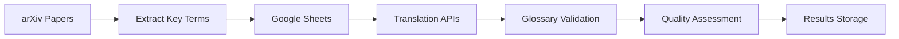

# Automated Quality Evaluation of AI-Generated Thai Translations

> **🔬 Bridging linguistics expertise with AI automation to evaluate academic translation quality**

An intelligent low-code workflow system that automatically evaluates the quality of AI-generated Thai translations for academic research papers, ensuring accuracy in specialized terminology.

## 🎯 Overview

This small project automates the evaluation of machine translations from English to Thai, specifically targeting academic research papers from arXiv. By combining linguistic expertise with n8n workflow automation, it provides consistent, scalable quality assessment of translations from multiple AI providers.

**📊 [Live Dataset](https://docs.google.com/spreadsheets/d/1TdoqwKmT44Vpvi-RT3Bl9qjrlA04zvOP2qU4XUbZi0A/edit?usp=drive_link)**

## ✨ Key Features

- **Multi-Provider Testing**: Compares translations from Google Translate, OpenAI (GPT), and Typhoon LLM
- **Domain-Specific Accuracy**: Uses custom Thai glossary for academic terminology validation  
- **Automated Workflow**: End-to-end processing with n8n automation
- **Quality Metrics**: Binary evaluation system with detailed error categorization
- **Batch Processing**: Efficient handling of multiple sentences and papers
- **Scalable Architecture**: Easily adaptable to other domains and languages

## 🔧 Technology Stack

- **n8n** - Workflow automation and orchestration
- **Google Sheets API** - Data storage and management  
- **arXiv API** - Academic paper collection
- **Translation APIs** - Google Translate, OpenAI, Typhoon
- **JavaScript/Python** - Custom evaluation logic

## 🚀 How It Works

1. **Data Collection**: Extracts sentences with key terms from arXiv papers
2. **Translation**: Processes text through multiple AI translation services
3. **Evaluation**: Compares outputs against curated Thai academic glossary
4. **Assessment**: Labels translations as "PASSED" or "REJECTED" with error details
5. **Storage**: Saves results back to Google Sheets for analysis

## 📋 Evaluation Methodology

### Glossary-Based Validation
- Verifies key academic terms match predefined Thai translations
- Example: "reinforcement learning" → "การเรียนรู้แบบเสริมแรง"

### Consistency Checking
- Ensures uniform translation of terms across entire text
- Identifies inconsistent terminology usage

### Quality Metrics
- **PASSED**: Accurate and consistent translation
- **REJECTED**: Incorrect translation with specific error categorization

## 🎯 Use Cases

- **Academic Translation**: Research paper localization for Thai audiences
- **Quality Assurance**: Systematic evaluation of translation services
- **Linguistic Research**: Comparative analysis of AI translation capabilities
- **Education**: Thai language learning materials verification

## 🔄 Future Enhancements

- [ ] Expand glossary to cover additional academic domains
- [ ] Integrate more translation providers for comparison
- [ ] Implement confidence scoring system
- [ ] Add support for other target languages
- [ ] Develop real-time translation evaluation API

## 🤝 Contributing

This project combines linguistic expertise with technical automation. Contributions welcome in:
- Thai language terminology validation
- Translation API integration
- Workflow optimization
- Documentation improvements

## 🔗 Links

- [Project Dataset]([https://docs.google.com/spreadsheets/d/1TdoqwKmT44Vpvi-RT3Bl9qjrlA04zvOP2qU4XUbZi0A/edit?usp=sharing](https://docs.google.com/spreadsheets/d/1TdoqwKmT44Vpvi-RT3Bl9qjrlA04zvOP2qU4XUbZi0A/edit?usp=drive_link))
- [arXiv API Documentation](https://arxiv.org/help/api)
- [n8n Documentation](https://docs.n8n.io/)

---

*Built with ❤️ by a linguist exploring the intersection of language and AI automation*
